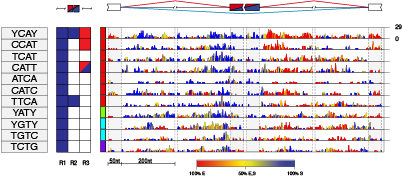

## RNAmotifs ##


[RNAmotifs](http://genomebiology.biomedcentral.com/articles/10.1186/gb-2014-15-1-r20) is an integrated *R, python, C++* software that evaluates the sequence around differentially regulated alternative exons to identify clusters of short sequences, referred to as multivalent RNA motifs, bound by RNA-binding result_dirs. From a list of alternatively spliced exons, RNAmotifs identifies clusters of short non-degenerate or degenerate tetramers that are enriched at specific positions around the enhanced and silenced exons. Moreover, RNAmotifs generates the RNA splicing map of entiched motifs. RNAmotifs has been successfully used for the identification of multivalent RNA motifs bound by RNA-binding result_dirs such as NOVA, PTBP1, hnRNP C, TARDBP, and TIA1 and TIAL1.



RNAmotifs is based on [GeCo++](http://bioinformatics.oxfordjournals.org/content/27/9/1313.long), a C++ class library that provides a class hierarchy for the development of bioinformatic algorithm when annotations of genomic elements (e.g. binding sites, mutations) to sequences are taken into account. GeCo++ is available @ http://bioinformatics.emedea.it/geco/


Please cite:

**Cereda M**, Pozzoli U, Rot G, Juvan P, Schweitzer A, Clark T, Ule J. *RNAmotifs: prediction of multivalent RNA motifs that control alternative splicing.* Genome Biol. 2014 Jan 31;15(1):R20. doi: 10.1186/gb-2014-15-1-r20. PMID: [24485098](http://www.ncbi.nlm.nih.gov/pubmed/24485098)


## Installation

- build GeCo++ software
```
cd gMotifs
mkdir build
cd build
cmake ../
make
```
- add root folder to Python path:
```
export PYTHONPATH=$PYTHONPATH:/path_to_RNAmotifs_root_folder
```

- Download *twoBitToFa* from http://hgdownload.cse.ucsc.edu/admin/exe it in the m3_light/genomes

```
cd m3_light/genomes
chmod 775 twoBitToFa
```

## Usage

- The list of alternative spliced exons should be provided in a semicolon-delimeted file containing:

row_id;second_id;chrom;strand;upstream_exon_end_position;exon_start_position;exon_end_position;dwstream_exon_start_position;diRank

- Download the fasta sequence of your genome of interest. Follow the intructions in (m3_light/genomes/hg19.download.sh), or in (m3_light/genomes/hg19.download.sh)
```
cd m3_light
cd genomes
./mm9.download.sh
./hg19.download.sh
```
-  change back to root folder, set required variables in (RNAmotifs.sh) and run the analysis (be carefull in selecting the genome of interest (Human or Mouse)):

```
./RNAmotifs.sh /absolute/path/to/RNAmotifs project_name splicing_change_filename.txt genome species

Example:

./RNAmotifs.sh /home/mcereda/RNAmotifs NOVA_regulation NOVA.txt mm9 Mouse


```
- To filter results and draw RNA splicing maps follow the steps reported in the following file: R/selection_of_tetramers.R

## Examples

In the folder "examples" you can find a list of alternative spliced exons in NOVA1/NOVA2 knockout mouse that have been used in [our publication](http://genomebiology.biomedcentral.com/articles/10.1186/gb-2014-15-1-r20)


## Contributors

RNAmotifs has been designed by Dr **Matteo Cereda** and Prof **Jernej Ule**. 

Main developer: Matteo Cereda, Marco Del Giudice. 

Contributing developers: Gregor Rot, Peter Juvan and Uberto Pozzoli.

Contributions are always welcome!

## License

Please read the [Licence](LICENSE) first