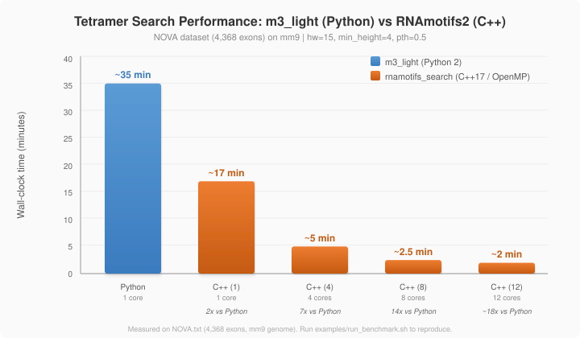

# RNAmotifs v2.0

RNAmotifs identifies clusters of short RNA motifs (tetramers) enriched at
specific positions around alternatively spliced exons regulated by RNA-binding
proteins. It generates RNA splicing maps showing positional enrichment of
multivalent motifs around enhanced and silenced exons.

RNAmotifs has been used to identify motifs bound by NOVA, PTBP1, hnRNP C,
TARDBP, TIA1 and TIAL1.


### Example: NOVA full analysis

The figures below were generated by running the full NOVA pipeline on mm9
with `--structure` and `--conservation` enabled:

```bash
./rnamotifs examples/NOVA.txt \
    --name NOVA --genome mm9 \
    --half-window 15 --min-height 4 --pth 0.5 \
    --enrichment-window 30 --in-exon 30 --in-intron 300 \
    --bootstraps 10000 --cores 10 \
    --p-fisher 0.1 --p-empirical 0.001 \
    --structure --structure-window 31 \
    --conservation
```

1. **RNA Splicing Map**
   ([PDF](examples/NOVA_splicing_map.pdf))
   -- Positional enrichment scores for each tetramer across the four regions
   flanking alternatively spliced exons. Color intensity encodes the combined
   Fisher's method score; the color gradient from blue to red indicates the
   proportion of enhanced vs silenced exon enrichment.

2. **RNA Secondary Structure Heatmap**
   ([PDF](examples/NOVA_structure_profile.pdf))
   -- Position-specific single-strandedness scores (from ViennaRNA RNAfold)
   for each enriched tetramer. Higher values (red) indicate positions more
   likely to be single-stranded. Tetramers are ordered as in the RNA splicing
   map, with cluster annotations on the left.

3. **Structure Cluster Profile**
   ([PDF](examples/NOVA_structure_cluster_profile.pdf))
   -- Cluster-averaged RNA structure profiles showing smoothed
   single-strandedness curves for Enhanced (red) and Silenced (blue) exons,
   with ribbon fill highlighting divergence regions.

4. **Conservation Heatmap**
   ([PDF](examples/NOVA_conservation_profile.pdf))
   -- PhyloP evolutionary conservation scores across positions flanking
   alternatively spliced exons. Higher values (yellow/bright) indicate
   stronger conservation. Tetramers are ordered as in the RNA splicing map,
   with cluster annotations on the left.

5. **Conservation Cluster Profile**
   ([PDF](examples/NOVA_conservation_cluster_profile.pdf))
   -- Cluster-averaged PhyloP conservation profiles showing smoothed curves
   for Enhanced (red) and Silenced (blue) exons, with ribbon fill
   highlighting regions of differential conservation.


## Citation

> Cereda M, Pozzoli U, Rot G, Juvan P, Schweitzer A, Clark T, Ule J.
> *RNAmotifs: prediction of multivalent RNA motifs that control alternative
> splicing.* Genome Biol. 2014;15(1):R20.
> [PMID: 24485098](https://pubmed.ncbi.nlm.nih.gov/24485098/)

## What's new in v2.0

RNAmotifs v2.0 is a complete rewrite of the
[original RNAmotifs](https://github.com/ceredamatteo-lab/RNAmotifs) pipeline.
The core algorithm and statistical methods are identical — the same input
produces the same results — but the implementation has been modernised for
speed, reproducibility, and usability.

### Performance

| Step | v1 (Python 2 + R) | v2 (C++17 / OpenMP) | Speedup |
|------|-------------------|---------------------|---------|
| Tetramer search | ~35 min (1 core, Python) | ~2 min (10 cores, C++) | **~18x** |
| Bootstrap FDR | ~90 sec (R, 1 core) | ~2 sec (C++, 10 cores) | **~45x** |
| Full pipeline | ~40 min | ~5 min | **~8-10x** |

#### Tetramer search benchmark

The chart below compares wall-clock time for the tetramer search step
(512 motifs, NOVA dataset with 4,368 exons on mm9, hw=15, min_height=4,
pth=0.5). The Python m3_light module is single-threaded; the C++
`rnamotifs_search` binary scales across cores via OpenMP.



The single-threaded C++ version is already ~2x faster than Python due to
in-memory chromosome caching, prefix-sum Bedgraph clustering, and
compiled string search. Multi-core scaling provides an additional ~7-9x
improvement, reaching ~18x total speedup at 12 cores.

To reproduce the benchmark on your machine:

```bash
bash benchmarks/run_benchmark.sh
```

v2 includes additional algorithmic optimisations:

- **Indexed BED lookup** — BED records are indexed by chromosome and strand
  with binary search (O(log N) per exon instead of O(N) linear scan),
  reducing tetramer mapping and counting from O(N×M) to O(N×log M)
- **Dense arrays with prefix sums** — Bedgraph clustering uses contiguous
  arrays with prefix sums for O(1) window queries instead of hash-map
  iteration
- **Constrained partition function** — RNA structure profiling uses the
  ViennaRNA constrained partition function ratio method with
  `compute_bpp=0`, avoiding unnecessary base-pair probability computation

### Language and architecture

| Component | v1 | v2 |
|-----------|----|----|
| Orchestrator | Bash script (`RNAmotifs.sh`) with positional args | Python 3 CLI with `argparse` |
| Motif search | Python 2 (`m3_light` package) | C++17 with OpenMP (`rnamotifs_search`) |
| Positional mapping | C++ with vendored GeCo++ headers | C++17 (no external C++ dependencies) |
| Region counting | C++ with vendored GeCo++ headers | C++17 (no external C++ dependencies) |
| Bootstrap FDR | R (`bootstrap-FDR.R`) | C++17 with OpenMP (`rnamotifs_bootstrap`) |
| Selection & RNA maps | R | R (cleaned, compatible with C++ bootstrap output) |
| Build system | CMake 2.6 | CMake 3.10+ with `find_package(OpenMP)` |

### New features

- **Multicore support** — `--cores` controls parallelism for both tetramer
  search (OpenMP) and bootstrap FDR (OpenMP)
- **Additional genomes** — hg38 and mm10 added alongside hg19 and mm9
- **Top-N filtering** — `--top-n` plots only the N highest-ranked
  tetramers in the RNA splicing map (full table always saved)
- **rMATS input** — Direct import of rMATS Skipped Exon output via
  `--from-rmats`, with configurable thresholds for alternative and
  constitutive exon selection
- **RNA structure profiling** — `--structure` computes per-position
  single-stranded scores using ViennaRNA local folding and generates
  heatmaps aligned to the RNA splicing map coordinate system
- **Conservation profiling** — `--conservation` computes per-position
  PhyloP conservation scores and generates heatmaps aligned to the RNA
  splicing map
- **Cluster-averaged profiles** — Both structure and conservation analyses
  produce cluster-averaged profile curves with ribbon fill showing the
  difference between enhanced and silenced exons
- **Parametric region sizes** — `--in-exon` and `--in-intron` control how
  far the analysis extends into exons and introns from each splice site
  (defaults: 30 bp and 300 bp). If an actual exon or intron is shorter
  than the threshold, half its length is used. Region spacing is computed
  dynamically to prevent overlap
- **Exon extraction tool** — `./rnamotifs-extract` retrieves genomic
  coordinates of exons where enriched tetramers occur, with BED or TSV
  output
- **Web GUI** — `./rnamotifs-gui` launches a local web interface with
  file upload, parameter form, live progress bar, tabbed PDF viewer, and
  interactive results dashboard
- **Progress bar** — Real-time progress with ETA for each pipeline step
- **Time estimation** — Micro-benchmark before bootstrap to estimate
  remaining time
- **Structured output** — Results in timestamped folders
  (`20260316_NOVA_mm9_w15_h4_...`) with full parameter encoding
- **Pipeline log** — `rnamotifs.log` saved in the results folder

### Code quality

- Python 2 upgraded to Python 3.8+
- C++ upgraded from C++03 to C++17
- Removed all GeCo++ dependency — pure standard C++17
- Removed vendored `anyoption.cpp` (600+ lines) — replaced with clean
  config parser
- Removed dead `struct.h` (260 lines of unused structs)
- Replaced `system("wc -l ...")` with `std::filesystem::directory_iterator`
- Config file validation with clear error messages
- Warning on malformed input lines and missing chromosome files
- All intermediate files (`m3_light/`) eliminated from the project tree

### Files removed vs v1

| v1 file | Replaced by |
|---------|-------------|
| `RNAmotifs.sh` (shell orchestrator) | `rnamotifs` (Python 3 CLI) |
| `m3_light/` (Python 2 package, 7 files) | `rnamotifs_search.cpp` (single C++ binary) |
| `R/bootstrap-FDR.R` | `bootstrap_fdr.cpp` (C++ with OpenMP) |
| `gMotifs/anyoption.cpp` + `anyoption.h` | Built-in config parser |
| `gMotifs/struct.h` (dead code) | Removed |
| `gMotifs/geco_*.cpp/h` (vendored) | Removed (no external C++ dependencies) |

### Verified equivalence

The C++ motif search produces **byte-identical output** to the Python
`m3_light` module (verified: 0 diffs across 1024 BED files). The C++
bootstrap FDR uses the same Fisher exact test, BH adjustment, and
resampling strategy as the R implementation.

---

## Requirements

- **C++17 compiler** with OpenMP support
  - Linux: GCC >= 7 (recommended)
  - macOS: Apple Clang with `libomp`, or GCC from Homebrew
- **CMake** >= 3.10
- **Python** >= 3.8
- **R** >= 4.0 with packages: `lattice`, `latticeExtra`, `ggplot2`,
  `reshape2`, `bootstrap`
- Genome `.string` files (see Genome setup below)

All C++ binaries are self-contained — there are no external C++ library
dependencies.

### Optional dependencies

- **[ViennaRNA](https://www.tbi.univie.ac.at/RNA/)** — Required for
  `--structure` (RNA secondary structure profiling). If not found at
  build time, `rnamotifs_structure` is skipped and the pipeline runs
  without structure analysis.
- **PhyloP conservation scores** — Required for `--conservation`. Download
  with `cd genomes && ./download_phylop.sh <genome>`. Requires
  `bigWigToBedGraph` from UCSC (for hg19/hg38/mm10 BigWig files).
- **[Flask](https://flask.palletsprojects.com/)** — Required for the web
  GUI (`pip install flask`).

## Installation

### Linux (Ubuntu/Debian)

1. **Install system dependencies:**

```bash
sudo apt-get update
sudo apt-get install -y build-essential g++ cmake \
    gfortran liblapack-dev libblas-dev libpng-dev libjpeg-dev \
    python3 r-base
```

2. **Build C++ binaries:**

```bash
mkdir build && cd build
cmake ..
make -j$(nproc)
cd ..
```

3. **Install R packages:**

```bash
Rscript -e 'install.packages(c("lattice", "latticeExtra",
  "ggplot2", "reshape2", "bootstrap"), repos="https://cloud.r-project.org")'
```

4. **Install ViennaRNA (optional, for `--structure`):**

```bash
sudo apt-get install -y vienna-rna libvienna-rna-dev
```

If ViennaRNA is installed before running `cmake`, it will be detected
automatically and `rnamotifs_structure` will be built. If not found, the
build succeeds but `--structure` is unavailable.

### macOS (Homebrew)

1. **Install system dependencies:**

```bash
brew install gcc cmake r vienna-rna
```

Apple Clang does not ship with OpenMP support. You have two options:

- **Option A — Use GCC from Homebrew** (recommended):

  ```bash
  brew install gcc
  ```

  Then specify the GCC compiler when running CMake (adjust the version
  number to match your installation, e.g. `gcc-13`/`g++-13`):

  ```bash
  mkdir build && cd build
  cmake .. -DCMAKE_C_COMPILER=gcc-13 -DCMAKE_CXX_COMPILER=g++-13
  make -j$(sysctl -n hw.ncpu)
  cd ..
  ```

- **Option B — Use Apple Clang with libomp**:

  ```bash
  brew install libomp
  mkdir build && cd build
  cmake ..
  make -j$(sysctl -n hw.ncpu)
  cd ..
  ```

2. **Install R packages:**

```bash
Rscript -e 'install.packages(c("lattice", "latticeExtra",
  "ggplot2", "reshape2", "bootstrap"), repos="https://cloud.r-project.org")'
```

ViennaRNA is included in the Homebrew install above (`brew install vienna-rna`).
CMake will detect it automatically.

### Genome setup

Download and prepare chromosome `.string` files (run once per genome):

```bash
cd genomes
./hg19.download.sh   # Human GRCh37
./hg38.download.sh   # Human GRCh38
./mm9.download.sh    # Mouse NCBI37
./mm10.download.sh   # Mouse GRCm38
cd ..
```

`twoBitToFa` can be downloaded from
https://hgdownload.cse.ucsc.edu/admin/exe/ — place it in `genomes/`.

### PhyloP conservation data (optional)

To enable `--conservation`, download PhyloP scores for your genome:

```bash
cd genomes
./download_phylop.sh hg19   # 100-way vertebrate PhyloP
./download_phylop.sh hg38   # 100-way vertebrate PhyloP
./download_phylop.sh mm9    # 30-way vertebrate PhyloP
./download_phylop.sh mm10   # 60-way vertebrate PhyloP
cd ..
```

This creates per-chromosome binary float arrays (`chr*.phylop.bin`) in the
genome directory. For BigWig genomes (hg19, hg38, mm10), `bigWigToBedGraph`
must be present in `genomes/` (download from UCSC).

## Usage

### Main pipeline

```bash
./rnamotifs examples/NOVA.txt \
    --name NOVA \
    --genome mm9 \
    --half-window 15 \
    --min-height 4 \
    --pth 0.5 \
    --enrichment-window 30 \
    --bootstraps 10000 \
    --cores 10 \
    --p-fisher 0.1 \
    --p-empirical 0.00005
```

### All CLI options

| Option | Description | Default |
|--------|-------------|---------|
| `input_file` | Splicing-change file (positional argument) | required |
| `-n, --name` | Analysis name (e.g. NOVA) | required |
| `-g, --genome` | Reference genome (`hg19`, `hg38`, `mm9`, `mm10`) | required |
| `-w, --half-window` | Half-window for clustering (bp) | 15 |
| `-m, --min-height` | Minimum cluster height | 4 |
| `-p, --pth` | Percentage threshold | 0.5 |
| `-e, --enrichment-window` | Enrichment window in bp | 30 |
| `-b, --bootstraps` | Bootstrap iterations | 10000 |
| `-c, --cores` | CPU cores for OpenMP parallelism | 1 |
| `--p-fisher` | Fisher p-value threshold | 0.1 |
| `--p-empirical` | Empirical p-value threshold | 0.00005 |
| `--top-n` | Plot only top N ranked tetramers (0 = all) | 0 |
| `--structure` | Compute RNA secondary structure profiles | off |
| `--structure-window` | Folding window size for structure profiling (nt) | 31 |
| `--conservation` | Compute PhyloP conservation profiles | off |
| `--in-exon` | Region extent into exons (bp) | 30 |
| `--in-intron` | Region extent into introns (bp) | 300 |
| `--from-rmats` | Input is an rMATS SE file | off |
| `--rmats-incl` | Min \|IncLevelDifference\| for alternative exons | 0.1 |
| `--rmats-fdr` | Max FDR for alternative exons | 0.05 |
| `--rmats-constit` | Max \|IncLevelDifference\| for constitutive exons | 0.01 |
| `--rmats-max-constit` | Max constitutive exons (randomly sampled if exceeded) | 5000 |

#### Top-N filtering

```bash
./rnamotifs examples/NOVA.txt \
    --name NOVA --genome mm9 \
    --bootstraps 10000 --cores 10 \
    --p-fisher 0.1 --p-empirical 0.00005 \
    --top-n 10
```

`--top-n` filters the RNA map plot to the N highest-ranked tetramers
(by combined Fisher score). The full enrichment table is always saved
regardless. Default is 0 (plot all significant tetramers).

### Supported genomes

| Genome | Species | Assembly |
|--------|---------|----------|
| `hg19` | Human | GRCh37 |
| `hg38` | Human | GRCh38 |
| `mm9`  | Mouse | NCBI37 |
| `mm10` | Mouse | GRCm38 |

### Using rMATS output as input

RNAmotifs can directly take
[rMATS](https://github.com/Xinglab/rmats-turbo) Skipped Exon (SE) output:

```bash
./rnamotifs SE.MATS.JC.txt \
    --from-rmats \
    --rmats-incl 0.1 \
    --rmats-fdr 0.05 \
    --rmats-constit 0.01 \
    --rmats-max-constit 5000 \
    --name MYRBP \
    --genome hg19 \
    --bootstraps 10000 \
    --cores 10 \
    --p-fisher 0.1 \
    --p-empirical 0.00005
```

The converter classifies rMATS exons as:

- **Enhanced**: `IncLevelDifference > 0`, `|IncLevelDifference| >= --rmats-incl`,
  `FDR <= --rmats-fdr`
- **Silenced**: `IncLevelDifference < 0`, `|IncLevelDifference| >= --rmats-incl`,
  `FDR <= --rmats-fdr`
- **Constitutive/control**: `|IncLevelDifference| <= --rmats-constit`

If the number of constitutive exons exceeds `--rmats-max-constit`, a random
sample is taken (seed 42 for reproducibility).

| rMATS option | Description | Default |
|---|---|---|
| `--rmats-incl` | Min \|IncLevelDifference\| for alternative exons | 0.1 |
| `--rmats-fdr` | Max FDR for alternative exons | 0.05 |
| `--rmats-constit` | Max \|IncLevelDifference\| for constitutive/control exons | 0.01 |
| `--rmats-max-constit` | Max number of constitutive exons; randomly sampled if exceeded | 5000 |

### RNA structure profiling (optional)

Compute per-position RNA secondary structure scores for enriched tetramers
using ViennaRNA local folding:

```bash
./rnamotifs examples/NOVA.txt \
    --name NOVA --genome mm9 \
    --bootstraps 10000 --cores 10 \
    --p-fisher 0.1 --p-empirical 0.00005 \
    --structure --structure-window 31
```

This requires ViennaRNA to be installed and detected at build time. The
analysis runs after the main pipeline and produces:

- **Structure heatmap** (`structure_profile.pdf`) — Heatmap of
  single-stranded scores aligned to the RNA splicing map, one row per
  enriched tetramer, with cluster colour annotations and separate panels
  for enhanced and silenced exons. Scores are computed using the
  constrained partition function ratio method (P(unpaired) = exp((G_free -
  G_constrained) / kT)). Uses a diverging blue-white-red colour palette.
- **Cluster-averaged curves** (`structure_cluster_profile.pdf`) — Smoothed
  curves showing the mean structure score per cluster, with ribbon fill
  highlighting the difference between enhanced and silenced exons.

The `--structure-window` option controls the ViennaRNA local folding window
size in nucleotides (default: 31).

### Conservation profiling (optional)

Compute per-position PhyloP conservation scores for enriched tetramers:

```bash
./rnamotifs examples/NOVA.txt \
    --name NOVA --genome mm9 \
    --bootstraps 10000 --cores 10 \
    --p-fisher 0.1 --p-empirical 0.00005 \
    --conservation
```

This requires pre-downloaded PhyloP binary files (see PhyloP conservation
data above). The analysis produces:

- **Conservation heatmap** (`conservation_profile.pdf`) — Heatmap of
  PhyloP scores aligned to the RNA splicing map, one row per enriched
  tetramer, with cluster colour annotations and separate panels for
  enhanced and silenced exons. Uses an inferno colour palette.
- **Cluster-averaged curves** (`conservation_cluster_profile.pdf`) —
  Smoothed curves showing the mean conservation score per cluster, with
  ribbon fill highlighting the difference between enhanced and silenced
  exons.

Both `--structure` and `--conservation` can be used together in a single
run.

### Extracting enriched tetramer exon coordinates

After running the main pipeline, use `rnamotifs-extract` to retrieve
genomic coordinates of exons where enriched tetramers have occurrences in
the flanking regions:

```bash
# Extract all enriched tetramers (TSV output)
./rnamotifs-extract results/<run_name>

# Extract a specific tetramer
./rnamotifs-extract results/<run_name> --tetramer YCAY

# Extract only silenced exons in BED format
./rnamotifs-extract results/<run_name> --tetramer YCAY --category silenced --bed

# Save to file
./rnamotifs-extract results/<run_name> -o output.tsv
```

| Option | Description | Default |
|--------|-------------|---------|
| `results_dir` | Path to a completed RNAmotifs results folder | required |
| `-t, --tetramer` | Extract for a specific tetramer | all enriched |
| `-c, --category` | Exon category: `enhanced`, `silenced`, or `both` | both |
| `-o, --output` | Output file (default: stdout) | stdout |
| `--bed` | Output in BED format instead of TSV | TSV |

TSV output columns: `tetramer`, `category`, `chrom`, `strand`,
`exon_start`, `exon_end`, `upstream_exon_end`, `downstream_exon_start`,
`dirank`, `exon_id`.

BED output columns: `chrom`, `start`, `end`, `tetramer|category`, `score`,
`strand`.

### Web GUI

Launch a local web interface:

```bash
pip install flask
./rnamotifs-gui --port 8080
```

Open `http://localhost:8080` in your browser. The GUI provides:

- **File upload** for splicing input files (native or rMATS SE format)
- **Parameter form** with all pipeline options, including rMATS thresholds
- **Live pipeline log** with animated progress bar and step labels
- **Tabbed PDF viewer** — all output PDFs (RNA splicing map, structure
  heatmap, structure clusters, conservation heatmap, conservation clusters)
  displayed as switchable tabs; additional PDFs auto-discovered
- **Enriched tetramers table** with significant rows highlighted in green
- **Bootstrap summary** with quick stats and download link
- **File browser** grouped by type (PDF, CSV, TSV, logs)
- **Run history** listing all previous analyses with status badges

| Option | Description | Default |
|--------|-------------|---------|
| `--port` | Server port | 8080 |
| `--host` | Server host | 127.0.0.1 |

### Input format

Semicolon-delimited file, one exon per line:

```
row_id;second_id;chrom;strand;upstream_exon_end;exon_start;exon_end;downstream_exon_start;dIRank
```

- `dIRank > 1`: enhanced exon
- `-1 < dIRank < 1`: control exon
- `dIRank < -1`: silenced exon

## Pipeline steps

1. **Region preparation + tetramer search** — Extract flanking regions
   around each exon (upstream intron, upstream exon, downstream exon,
   downstream intron), scan all 512 tetramers (256 ACGT + 256 IUPAC
   degenerate) with clustering and thresholding
   (C++17, OpenMP parallel)
2. **File organisation** — Sort tetramer BED files into non-redundant
   (`nr/`) and redundant (`r/`) directories based on nucleotide alphabet
3. **Positional mapping + region counting** — Map tetramer hit positions
   to the RNA splicing map coordinate system and count exons with hits in
   enrichment windows around exon-intron boundaries (C++17)
4. **Bootstrap FDR** — For each tetramer and region, test enrichment in
   enhanced/silenced vs control exons using Fisher's exact test. Assess
   significance with bootstrap resampling of exon labels (C++, OpenMP
   parallel)
5. **Selection and visualisation** — Identify significant motifs (combined
   Fisher and empirical p-value thresholds), rank by combined Fisher
   method score, cluster by positional similarity, and generate RNA
   splicing maps as PDF heatmaps (R)
6. **Structure profiling** (optional, `--structure`) — For each enriched
   tetramer, compute average single-stranded score at each position using
   ViennaRNA local folding; generate heatmap and cluster-averaged curves
   (C++ + R)
7. **Conservation profiling** (optional, `--conservation`) — For each
   enriched tetramer, compute average PhyloP score at each position;
   generate heatmap and cluster-averaged curves (C++ + R)

## Output

Results are saved in `results/<date>_<name>_<params>/`:

| File | Description |
|------|-------------|
| `rnamotifs.log` | Full pipeline log with timings |
| `bootstrap_<N>.tsv` | Bootstrap FDR p-values per tetramer and region (Fisher and empirical) |
| `MRMs_<name>_*.csv` | Enriched tetramer table with cluster assignments, significance flags, and p-values |
| `MRMs_<name>_*.pdf` | RNA splicing maps (combined score heatmaps) |
| `MRMs_<name>_*.Rdata` | R objects for further analysis |
| `data/tetramers/nr/` | Per-tetramer BED files (non-redundant alphabet: A, C, G, T) |
| `data/tetramers/r/` | Per-tetramer BED files (redundant/IUPAC alphabet: R, Y, S, W) |
| `data/counts/nr/` | Per-tetramer region counts (non-redundant) |
| `data/counts/r/` | Per-tetramer region counts (redundant) |
| `structure_profile.tsv` | Per-tetramer, per-position single-stranded scores (if `--structure`) |
| `structure_profile.pdf` | RNA structure heatmap (if `--structure`) |
| `structure_cluster_profile.pdf` | Cluster-averaged structure curves (if `--structure`) |
| `conservation_profile.tsv` | Per-tetramer, per-position PhyloP scores (if `--conservation`) |
| `conservation_profile.pdf` | Conservation heatmap (if `--conservation`) |
| `conservation_cluster_profile.pdf` | Cluster-averaged conservation curves (if `--conservation`) |
| `enriched_tets.txt` | List of enriched tetramer names (if `--structure` or `--conservation`) |
| `tetramer_order.txt` | Tetramer ordering with cluster assignments (TSV: tetramer, cluster_id) matching the RNA splicing map display order |

## Project structure

```
RNAmotifs2/
├── rnamotifs                      # CLI entry point (Python 3)
├── rnamotifs-extract              # Extract enriched tetramer exon coordinates
├── rnamotifs-gui                  # Web GUI (Flask)
├── CMakeLists.txt                 # Build system
├── src/
│   ├── cpp/                       # C++17 / OpenMP
│   │   ├── rnamotifs_core.h/cpp   #   Shared: config, BedRecord, mapping
│   │   ├── tetramer.cpp           #   Positional mapping
│   │   ├── counting.cpp           #   Region counting
│   │   ├── rnamotifs_search.cpp   #   Motif search + clustering
│   │   ├── bootstrap_fdr.cpp      #   Bootstrap FDR
│   │   ├── rnamotifs_structure.cpp    # RNA structure (ViennaRNA)
│   │   └── rnamotifs_conservation.cpp # PhyloP conservation
│   └── R/                         # Visualisation
│       ├── config.R               #   Shared functions & RNA map plotting
│       ├── selection.R            #   Tetramer selection & RNA maps
│       ├── structure_profile.R    #   RNA structure heatmaps
│       ├── conservation_profile.R #   PhyloP conservation heatmaps
│       └── cluster_profile.R      #   Cluster-averaged profile curves
├── genomes/                       # Genome data (user downloads)
│   ├── hg19.download.sh
│   ├── hg38.download.sh
│   ├── mm9.download.sh
│   ├── mm10.download.sh
│   └── download_phylop.sh        # PhyloP conservation score downloader
├── examples/
│   ├── NOVA.txt                   # Example input
│   ├── NOVA.png                   # Example RNA splicing map
│   ├── NOVA_splicing_map.pdf      # RNA splicing map (full run)
│   ├── NOVA_structure_profile.pdf # RNA structure heatmap
│   ├── NOVA_structure_cluster_profile.pdf  # Structure cluster curves
│   ├── NOVA_conservation_profile.pdf       # Conservation heatmap
│   └── NOVA_conservation_cluster_profile.pdf # Conservation cluster curves
└── LICENSE
```

Directories created at runtime: `build/`, `input/`, `results/`, `tetramers/`,
`regions/`.

## Contributors

Designed by **Matteo Cereda** and **Jernej Ule**.
Main developer: Matteo Cereda.
Contributing developers: Gregor Rot, Peter Juvan, Uberto Pozzoli.

## License

[GPL-2.0-or-later](LICENSE)
