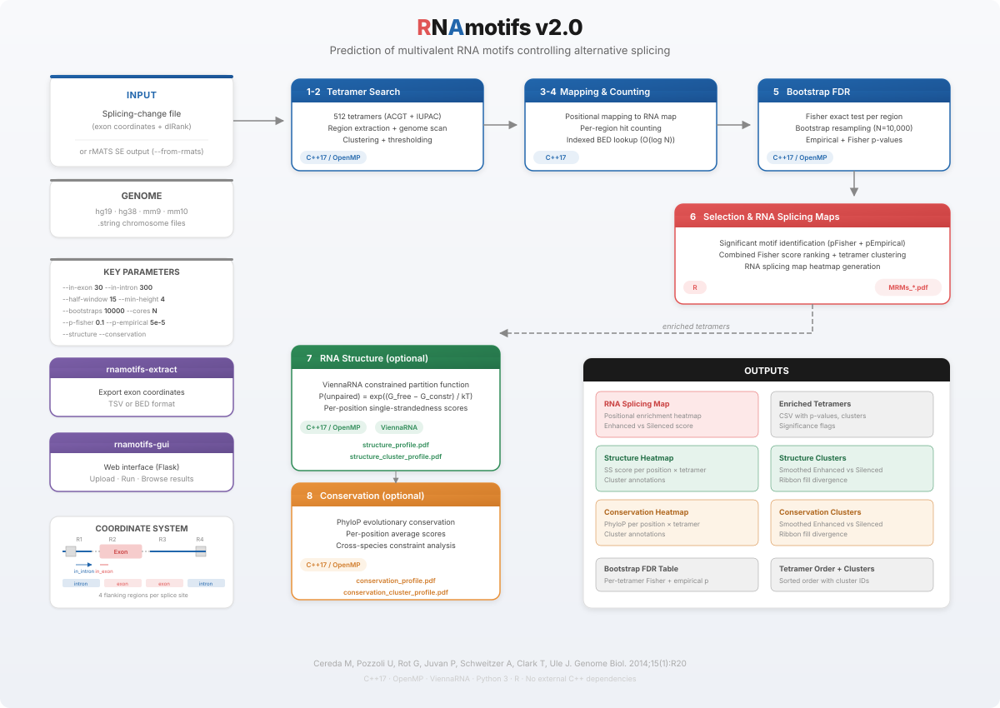

<p align="center">
  
</p>

<h3 align="center">Prediction of multivalent RNA motifs controlling alternative splicing</h3>

<p align="center">
  <a href="#installation">Installation</a> &middot;
  <a href="#quick-start">Quick start</a> &middot;
  <a href="#usage">Usage</a> &middot;
  <a href="#tools">Tools</a> &middot;
  <a href="#rnamotifs-mars">MaRs</a> &middot;
  <a href="#tutorials">Tutorials</a> &middot;
  <a href="#data-preparation">Data preparation</a> &middot;
  <a href="#performance">Performance</a> &middot;
  <a href="#citation">Citation</a>
</p>

---

RNAmotifs identifies clusters of short RNA motifs (tetramers) enriched at specific positions around alternatively spliced exons regulated by RNA-binding proteins. It generates **RNA splicing maps** showing positional enrichment of multivalent motifs around enhanced and silenced exons, with optional **RNA secondary structure** and **evolutionary conservation** profiling.

RNAmotifs has been used to identify motifs bound by NOVA, PTBP1, hnRNP C, TARDBP, TIA1 and TIAL1.

<p align="center">
  
</p>

## Citation

> Cereda M, Pozzoli U, Rot G, Juvan P, Schweitzer A, Clark T, Ule J.
> *RNAmotifs: prediction of multivalent RNA motifs that control alternative splicing.*
> Genome Biol. 2014;15(1):R20.
> [PMID: 24485098](https://pubmed.ncbi.nlm.nih.gov/24485098/)

---

## Installation

### Linux (Ubuntu/Debian)

```bash
# 1. Install system dependencies
sudo apt-get update
sudo apt-get install -y build-essential g++ cmake \
    gfortran liblapack-dev libblas-dev libpng-dev libjpeg-dev \
    python3 r-base

# 2. Build C++ binaries
mkdir build && cd build
cmake ..
make -j$(nproc)
cd ..

# 3. Install R packages
Rscript -e 'install.packages(c("lattice", "latticeExtra",
  "ggplot2", "reshape2", "bootstrap"), repos="https://cloud.r-project.org")'

# 4. (Optional) Install ViennaRNA for --structure
sudo apt-get install -y vienna-rna libvienna-rna-dev
```

### macOS (Homebrew)

```bash
# 1. Install dependencies (GCC recommended for OpenMP)
brew install gcc cmake r vienna-rna

# 2. Build with GCC (adjust version number, e.g. gcc-13)
mkdir build && cd build
cmake .. -DCMAKE_C_COMPILER=gcc-13 -DCMAKE_CXX_COMPILER=g++-13
make -j$(sysctl -n hw.ncpu)
cd ..

# 3. Install R packages
Rscript -e 'install.packages(c("lattice", "latticeExtra",
  "ggplot2", "reshape2", "bootstrap"), repos="https://cloud.r-project.org")'
```

### Genome setup

```bash
cd genomes
./mm9.download.sh    # Mouse NCBI37
./hg19.download.sh   # Human GRCh37
./hg38.download.sh   # Human GRCh38
./mm10.download.sh   # Mouse GRCm38
cd ..
```

### PhyloP conservation data (optional)

```bash
cd genomes
./download_phylop.sh mm9    # 30-way vertebrate PhyloP
./download_phylop.sh hg19   # 100-way vertebrate PhyloP
cd ..
```

### Requirements summary

| Component | Required | Notes |
|-----------|----------|-------|
| C++17 compiler + OpenMP | Yes | GCC >= 7 (Linux), GCC via Homebrew (macOS) |
| CMake >= 3.10 | Yes | |
| Python >= 3.8 | Yes | |
| R >= 4.0 | Yes | `lattice`, `latticeExtra`, `ggplot2`, `reshape2`, `bootstrap` |
| ViennaRNA | Optional | For `--structure` profiling |
| PhyloP `.bin` files | Optional | For `--conservation` profiling |
| Flask | Optional | For web GUI (`pip install flask`) |

All C++ binaries are self-contained -- no external C++ library dependencies.

---

## Quick start

```bash
./rnamotifs examples/NOVA.txt \
    --name NOVA --genome mm9 \
    --bootstraps 10000 --cores 10 \
    --p-empirical 0.001 \
    --structure --conservation
```

---

## Usage

### CLI options

| Option | Description | Default |
|--------|-------------|---------|
| `input_file` | Splicing-change file (positional) | required |
| `-n, --name` | Analysis name (e.g. NOVA) | required |
| `-g, --genome` | Reference genome (`hg19`, `hg38`, `mm9`, `mm10`) | required |
| `-w, --half-window` | Half-window for clustering (bp) | 15 |
| `-m, --min-height` | Minimum cluster height | 4 |
| `-p, --pth` | Percentage threshold | 0.5 |
| `-e, --enrichment-window` | Enrichment window (bp) | 30 |
| `--in-exon` | Region extent into exons (bp) | 30 |
| `--in-intron` | Region extent into introns (bp) | 300 |
| `-b, --bootstraps` | Bootstrap iterations | 10000 |
| `-c, --cores` | CPU cores (OpenMP) | 1 |
| `--p-fisher` | Fisher p-value threshold | 0.1 |
| `--p-empirical` | Empirical p-value threshold | 0.00005 |
| `--top-n` | Plot only top N tetramers (0 = all) | 0 |
| `--structure` | RNA secondary structure profiling | off |
| `--structure-window` | ViennaRNA folding window (nt) | 31 |
| `--conservation` | PhyloP conservation profiling | off |
| `--event-type` | Splicing event type: `SE` (skipped exon) or `RI` (intron retention) | SE |
| `--from-rmats` | Input is rMATS SE format | off |
| `--rmats-incl` | Min \|IncLevelDifference\| (alternative) | 0.1 |
| `--rmats-fdr` | Max FDR (alternative) | 0.05 |
| `--rmats-constit` | Max \|IncLevelDifference\| (constitutive) | 0.01 |
| `--rmats-max-constit` | Max constitutive exons | 5000 |

### Input format

Semicolon-delimited file, one event per line:

**Skipped exon (SE, default):**
```
row_id;second_id;chrom;strand;upstream_exon_end;exon_start;exon_end;downstream_exon_start;dIRank
```

**Intron retention (RI):**
```
row_id;second_id;chrom;strand;upstream_exon_start;5SS;3SS;downstream_exon_end;dIRank;RI
```

For RI events, the 10th field `;RI` marks the event type. The four coordinate fields encode: the upstream exon start (v5), the 5' splice site (v6), the 3' splice site (v7), and the downstream exon end (v8). The retained intron spans from v6 to v7.

**dIRank classification:**
- `dIRank > 1`: enhanced (inclusion/retention promoted by RBP)
- `-1 < dIRank < 1`: control
- `dIRank < -1`: silenced (inclusion/retention repressed by RBP)

**Region definitions by event type:**

| Region | Skipped exon (SE) | Intron retention (RI) |
|--------|-------------------|----------------------|
| R1 | upstream intron | upstream exon (near 5'SS) |
| R2 | exon body | first half of retained intron |
| R3 | downstream intron | second half of retained intron |
| R4 | distal flank | downstream exon (near 3'SS) |

The `--in-exon` parameter controls the extent into exonic regions (R2 for SE, R1/R4 for RI). The `--in-intron` parameter controls the extent into intronic regions (R1/R3 for SE, R2/R3 for RI).

### rMATS input

```bash
./rnamotifs SE.MATS.JC.txt \
    --from-rmats --rmats-incl 0.1 --rmats-fdr 0.05 \
    --name MYRBP --genome hg19 \
    --bootstraps 10000 --cores 10
```

### Structure and conservation profiling

```bash
./rnamotifs input.txt --name NOVA --genome mm9 \
    --structure --structure-window 31 \
    --conservation \
    --cores 12
```

Both analyses produce heatmaps aligned to the RNA splicing map coordinate system, with cluster colour annotations, plus cluster-averaged profile curves with ribbon fill highlighting Enhanced vs Silenced divergence.

### Supported genomes

| Genome | Species | Assembly |
|--------|---------|----------|
| `hg19` | Human | GRCh37 |
| `hg38` | Human | GRCh38 |
| `mm9`  | Mouse | NCBI37 |
| `mm10` | Mouse | GRCm38 |

---

## Tools

### `rnamotifs` -- Main pipeline

The core tool. Runs the complete motif discovery pipeline from splicing file to RNA splicing maps.

### `rnamotifs-extract` -- Export enriched tetramer coordinates

```bash
./rnamotifs-extract results/<run_name>                    # All enriched, TSV
./rnamotifs-extract results/<run_name> -t YCAY --bed      # Specific tetramer, BED
./rnamotifs-extract results/<run_name> -c silenced -o out.tsv
```

| Option | Description | Default |
|--------|-------------|---------|
| `results_dir` | Path to a completed results folder (positional) | required |
| `-t, --tetramer` | Extract for a specific tetramer | all enriched |
| `-c, --category` | Exon category: `enhanced`, `silenced`, `both` | both |
| `-o, --output` | Output file | stdout |
| `--bed` | Output in BED format | TSV |

### `rnamotifs-gui` -- Web interface

```bash
pip install flask
./rnamotifs-gui --port 8080
```

| Option | Description | Default |
|--------|-------------|---------|
| `--port` | Server port | 8080 |
| `--host` | Server host | 127.0.0.1 |
| `--spa` | Serve the modern SPA at `/` instead of the classic UI | off |

Features: file upload, parameter form, live progress bar, tabbed PDF viewer (RNA splicing map, structure/conservation heatmaps and cluster profiles), enriched tetramers table, file browser, run history.

A PHP-based interface is also available in `web/` (requires Apache/nginx + PHP).

### `rnamotifs-mars` -- MRM-RBP association scores

See the dedicated [RNAmotifs-MaRs](#rnamotifs-mars) section below.

---

## RNAmotifs-MaRs

RNAmotifs-MaRs integrates RNAmotifs motif discovery with eCLIP RBP binding data to compute **MRM-RBP association scores**. It extends the [RNAMaRs](https://github.com/ceredamatteo-lab/theRNAmars) framework by coupling it directly with the RNAmotifs motif enrichment pipeline.

### How it works

The pipeline runs in three phases:

| Phase | Name | What it does |
|-------|------|-------------|
| **1** | Multi-parameter sweep | Runs RNAmotifs across multiple `hw` / `ew` parameter combinations to identify enriched tetramers under different clustering stringencies |
| **2** | Signal recovery rate (SCORE1) | For each RBP, downsamples eCLIP peaks and measures how well motif positions recover the eCLIP signal. Quantifies how much RBP binding is explained by each tetramer cluster |
| **3** | Cosine similarity (SCORE2) | Computes the cosine similarity between the RNAmotifs positional profile and the eCLIP binding profile, producing a profile-level association score |

The combined scores are visualised as heatmaps showing MRM-RBP associations.

### CLI options

| Option | Description | Default |
|--------|-------------|---------|
| `input_file` | Splicing-change file (positional) | required |
| `-n, --name` | Analysis name | required |
| `-g, --genome` | Reference genome (`hg19`, `hg38`, `mm9`, `mm10`) | hg19 |
| `--cell-line` | Cell line for eCLIP comparison (`HepG2` or `K562`) | required |
| `--eclip-dir` | Path to eCLIP peaks directory | required |
| `--mars-dir` | Path to RNAmars data directory (containing `Tables/`, `Rdata/`) | required |
| `-c, --cores` | CPU cores | 1 |
| `--deseq-file` | Optional DESeq2 differential expression file (`.tsv` or `.rds`) | none |
| `--in-exon` | Region extent into exons (bp) | 30 |
| `--in-intron` | Region extent into introns (bp) | 300 |
| `-b, --bootstraps` | Bootstrap iterations | 10000 |
| `--p-fisher` | Fisher p-value threshold | 0.1 |
| `--p-empirical` | Empirical p-value threshold | 0.00005 |
| `--min-height` | Minimum cluster height | 4 |
| `--pth` | Percentage threshold | 0.5 |
| `--skip-rnamotifs` | Skip Phase 1 (assume results already exist) | off |
| `--skip-scores` | Skip Phase 2 (score computation) | off |

### Example: PTBP1 on HepG2

```bash
./rnamotifs-mars data/mars_exons/HepG2/PTBP1.txt \
    --name PTBP1 --genome hg19 \
    --cell-line HepG2 \
    --eclip-dir data/eCLIP_processed/HepG2/hg19 \
    --mars-dir /path/to/theRNAmars \
    --cores 12
```

### Required data

| Data | Source | Description |
|------|--------|-------------|
| eCLIP peaks | `data/eCLIP_processed/<cell_line>/hg19/` | Processed eCLIP iCount peaks per RBP (BED format) |
| RNAmars tables | `--mars-dir` path | Optimal parameters table, AUC metrics, binding profiles from the [theRNAmars](https://github.com/ceredamatteo-lab/theRNAmars) repository |
| Exon input file | `data/mars_exons/<cell_line>/<RBP>.txt` | Classified exons from `prepare_mars_exons.py` |
| DESeq2 (optional) | `data/encode_deseq_rmats/DESeq2/` | Differential expression for gene-level filtering |

### Output files

All output is collected in a single directory: `results/MaRs_<name>_<cell_line>_<genome>/`

| File | Description |
|------|-------------|
| `sweep/<name>_hw_<hw>_ew_<ew>/` | Per-parameter RNAmotifs results (Phase 1) |
| `SCORE1_enh_signal_recovery_rate_<name>.rds` | Enhanced signal recovery scores (Phase 2) |
| `SCORE1_sil_signal_recovery_rate_<name>.rds` | Silenced signal recovery scores (Phase 2) |
| `SCORE2_enh_profile_similarity_<name>.rds` | Enhanced cosine similarity scores (Phase 2) |
| `SCORE2_sil_profile_similarity_<name>.rds` | Silenced cosine similarity scores (Phase 2) |
| `<cell_line>_<name>_enh.pdf` | Enhanced association heatmap (Phase 3) |
| `<cell_line>_<name>_sil.pdf` | Silenced association heatmap (Phase 3) |

### Discovery mode

Discovery mode trains optimal RNAmotifs parameters per RBP using knockdown splicing data and eCLIP binding data. It determines which `(hw, ew)` parameter combination maximizes the MRM-RBP association score for each reference RBP, producing the trained reference files needed by application mode.

**What it does:**

1. For each reference RBP (15 for HepG2, 13 for K562), runs RNAmotifs across a parameter grid of half-window and enrichment window values
2. Scores each parameter combination against the RBP's own eCLIP profile using the C++ `rnamotifs_mars_score` binary
3. Selects the optimal `(hw, ew)` that maximizes `mean(SCORE1 x SCORE2)` across enriched tetramers
4. Computes PEAK normalized binding profiles and AUC reference values for all RBPs

RBPs are processed sequentially to keep peak memory below 2 GB regardless of panel size.

**Prerequisites:**

- Per-RBP knockdown exon files generated by `prepare_mars_exons.py` (in `data/mars_exons/<cell_line>/`)
- Processed eCLIP peak files in BED format (in `data/eCLIP_processed/<cell_line>/<genome>/`)
- A `--mars-dir` directory where output reference files will be written (creates `Tables/` and `Rdata/` subdirectories)

**Example:**

```bash
./rnamotifs-mars dummy.txt --mode discovery \
    --cell-line HepG2 --mars-exons-dir data/mars_exons/HepG2 \
    --eclip-dir data/eCLIP_processed/HepG2/hg19 \
    --mars-dir data/mars_reference -n discovery_HepG2 -g hg19 \
    -c 8 -b 1000 --p-empirical 0.01
```

Note: the `input_file` positional argument (e.g. `dummy.txt`) is unused in discovery mode but still required by the argument parser.

**Outputs (written to `--mars-dir`):**

| File | Description |
|------|-------------|
| `Tables/RNAmotifs_optimal_parameters.csv` | Optimal `(hw, ew)` per RBP |
| `Rdata/<cell_line>_AUC.tsv` | AUC-based signal recovery metrics per RBP |
| `Rdata/<cell_line>_PEAK_*.tsv` | Normalized eCLIP binding profiles (via `--compute-peak` in `rnamotifs_mars_score`) |

Intermediate results are written to `results/MaRs_discovery_<cell_line>_<genome>/`, with per-RBP subdirectories containing `sweep/` (RNAmotifs runs) and `scores/` (association scores with a `diagnostics/` subfolder for per-parameter SCORE1/SCORE2 matrices).

**Parameter grid customization:**

| Option | Default | Description |
|--------|---------|-------------|
| `--param-grid-hw` | `5 15 25 35` | Half-window values to test |
| `--param-grid-ew` | `30 50 100 200 300` | Enrichment window values to test |

The default grid yields 20 parameter combinations per RBP. Example with a reduced grid:

```bash
./rnamotifs-mars dummy.txt --mode discovery \
    --param-grid-hw 15 25 --param-grid-ew 50 100 200 \
    ...
```

**Crash-safe resumption:**

Discovery mode persists progress in a JSON manifest (`discovery_manifest.json`) after each parameter combination. If the pipeline is interrupted, rerunning the same command will skip already-completed RBPs and parameter combinations automatically. Non-optimal scoring directories are cleaned up after each RBP to conserve disk space.

**Runtime estimates:**

A full discovery run with 15 RBPs, 20 parameter combinations each, and 1,000 bootstrap iterations per combination completes in approximately 9--12 hours on a 10-core workstation. Using `--bootstraps 1000` (instead of the default 10,000) is recommended for discovery mode since the parameter search does not require high-precision p-values.

### R dependencies for MaRs

Install with `Rscript install_mars_deps.R`. Key packages:

- **ComplexHeatmap** (Bioconductor) -- heatmap visualisation
- **lsa** -- cosine similarity computation
- **circlize**, **viridis** -- colour palettes
- **data.table**, **dplyr**, **tidyr** -- data manipulation

---

## Tutorials

### Tutorial 1: Quick start with NOVA (mm9)

Estimated runtime: ~5 minutes (12 cores, without structure/conservation).

```bash
# 1. Download the mm9 genome
cd genomes && ./mm9.download.sh && cd ..

# 2. Run the pipeline
./rnamotifs examples/NOVA.txt \
    --name NOVA --genome mm9 \
    --bootstraps 10000 --cores 12 \
    --p-empirical 0.001

# 3. View results
ls results/*NOVA*/
# MRMs_NOVA_*.pdf           <- RNA splicing map
# MRMs_NOVA_*.csv           <- Enriched tetramer table
# rnamotifs.log             <- Pipeline log with timings
```

The output PDF shows positional enrichment of tetramer clusters around enhanced (red) and silenced (blue) exons.

### Tutorial 2: PTBP1 analysis from ENCODE data (hg19)

Estimated runtime: ~10 minutes (12 cores, with structure and conservation).

```bash
# 1. Download the hg19 genome and PhyloP data
cd genomes && ./hg19.download.sh && cd ..
cd genomes && ./download_phylop.sh hg19 && cd ..

# 2. Prepare exons from ENCODE rMATS data
python3 data/prepare_mars_exons.py \
    --rmats-dir data/encode_deseq_rmats/rMATS/HepG2 \
    --eclip-dir data/eCLIP_processed/HepG2/hg19 \
    --cell-line HepG2 \
    --rbp PTBP1 \
    --output data/mars_exons/HepG2

# 3. Run RNAmotifs on the classified exons
./rnamotifs data/mars_exons/HepG2/PTBP1.txt \
    --name PTBP1 --genome hg19 \
    --bootstraps 10000 --cores 12 \
    --p-empirical 0.001

# 4. View the RNA splicing map
ls results/*PTBP1*/MRMs_PTBP1_*.pdf

# 5. Re-run with structure and conservation profiling
./rnamotifs data/mars_exons/HepG2/PTBP1.txt \
    --name PTBP1_full --genome hg19 \
    --bootstraps 10000 --cores 12 \
    --p-empirical 0.001 \
    --structure --structure-window 31 \
    --conservation
```

Output includes splicing maps, structure heatmaps, conservation heatmaps, and cluster-averaged profile curves.

### Tutorial 3: rMATS input (direct import)

Use `--from-rmats` to skip manual exon classification and feed an rMATS Skipped Exon file directly.

```bash
# Run directly on an rMATS SE output file
./rnamotifs SE.MATS.JC.txt \
    --from-rmats \
    --rmats-incl 0.1 --rmats-fdr 0.05 \
    --rmats-constit 0.01 --rmats-max-constit 5000 \
    --name MYRBP --genome hg19 \
    --bootstraps 10000 --cores 12
```

The `--from-rmats` flag automatically:
- Classifies exons with \|IncLevelDifference\| > `--rmats-incl` and FDR < `--rmats-fdr` as alternative (enhanced or silenced)
- Classifies exons with \|IncLevelDifference\| <= `--rmats-constit` as constitutive controls
- Randomly samples up to `--rmats-max-constit` constitutive exons if more are available

### Tutorial 4: RNAmotifs-MaRs association scores

Prerequisites: a completed `rnamotifs` run and processed eCLIP data.

```bash
# 1. Install MaRs R dependencies
Rscript install_mars_deps.R

# 2. Run the MaRs pipeline for PTBP1 on HepG2
./rnamotifs-mars data/mars_exons/HepG2/PTBP1.txt \
    --name PTBP1 --genome hg19 \
    --cell-line HepG2 \
    --eclip-dir data/eCLIP_processed/HepG2/hg19 \
    --mars-dir /path/to/theRNAmars \
    --cores 12

# 3. View the heatmaps
ls results/MaRs_PTBP1_HepG2_hg19/
# HepG2_PTBP1_enh.pdf      <- Enhanced association heatmap
# HepG2_PTBP1_sil.pdf      <- Silenced association heatmap
# sweep/                    <- Per-parameter RNAmotifs results
```

The heatmaps show per-RBP association scores for each enriched tetramer cluster. High scores indicate strong MRM-RBP binding agreement between motif positional enrichment and eCLIP crosslink density.

### Tutorial 5: RNAmotifs-MaRs discovery mode (parameter training)

Train optimal parameters for HepG2 reference RBPs. This produces the reference files that application mode (Tutorial 4) requires.

Estimated runtime: ~9--12 hours (8 cores, 1,000 bootstraps, full 20-combination grid).

```bash
# 1. Prepare knockdown exon files for all HepG2 RBPs
python3 data/prepare_mars_exons.py \
    --rmats-dir data/encode_deseq_rmats/rMATS/HepG2 \
    --eclip-dir data/eCLIP_processed/HepG2/hg19 \
    --cell-line HepG2 \
    --output data/mars_exons/HepG2

# 2. Create the output directory for trained reference data
mkdir -p data/mars_reference

# 3. Run discovery mode
./rnamotifs-mars dummy.txt --mode discovery \
    --cell-line HepG2 --mars-exons-dir data/mars_exons/HepG2 \
    --eclip-dir data/eCLIP_processed/HepG2/hg19 \
    --mars-dir data/mars_reference -n discovery_HepG2 -g hg19 \
    -c 8 -b 1000 --p-empirical 0.01

# 4. Check outputs
cat data/mars_reference/Tables/RNAmotifs_optimal_parameters.csv
ls data/mars_reference/Rdata/

# 5. Use the trained reference in application mode
./rnamotifs-mars my_exons.txt \
    --name my_analysis --genome hg19 \
    --cell-line HepG2 \
    --eclip-dir data/eCLIP_processed/HepG2/hg19 \
    --mars-dir data/mars_reference \
    --cores 8
```

If the run is interrupted, simply rerun the same command -- it will resume from where it left off.

### Tutorial 6: Intron retention analysis

RNAmotifs supports intron retention (RI) events in addition to cassette exons (SE). For RI, regions R2 and R3 scan the retained intron (first and second half respectively), while R1 and R4 cover the flanking exons.

```bash
# 1. Prepare RI input from rMATS
python3 data/prepare_mars_exons.py \
    --rmats-dir data/encode_deseq_rmats/rMATS/HepG2 \
    --eclip-dir data/eCLIP_processed/HepG2/hg19 \
    --cell-line HepG2 --rbp PTBP1 \
    --event-type RI --no-cassette-filter \
    --output data/mars_exons/HepG2

# 2. Run RNAmotifs with --event-type RI
./rnamotifs data/mars_exons/HepG2/PTBP1_input_rnamotifs_RI.txt \
    -n PTBP1_RI -g hg19 \
    -w 15 -e 30 --in-exon 30 --in-intron 300 \
    -b 1000 -c 4 --p-empirical 0.01 \
    --event-type RI

# 3. Generate IR splicing map for top tetramers
Rscript src/R/ir_splicing_map.R results/<run_dir> output.pdf 30 300
```

The IR splicing map uses the same lattice rendering as SE but with adapted region layout:
- Shaded regions (gray) = flanking exons (R1, R4)
- Unshaded regions (white) = retained intron halves (R2, R3)
- Top ticks mark the 5' and 3' splice sites
- Bar colour encodes Enhanced (red) vs Silenced (blue) ratio

The `--in-exon` and `--in-intron` parameters retain their biological meaning: `--in-exon` controls the extent into exonic regions (R1/R4 for RI), `--in-intron` controls the extent into intronic regions (R2/R3 for RI). For short retained introns (< 2 × `in_intron`), R2 and R3 automatically meet at the intron midpoint.

### Tutorial 7: Web GUI

```bash
# Option A: Flask GUI (recommended)
pip install flask
./rnamotifs-gui --port 8080
# Open http://127.0.0.1:8080 in your browser

# Option B: Flask SPA (modern interface)
./rnamotifs-gui --port 8080 --spa

# Option C: PHP server (requires PHP)
cd web && php -S 127.0.0.1:8080 server.php
```

Workflow:
1. **Upload** a splicing-change file (or select an existing one)
2. **Configure** parameters: genome, name, cores, bootstrap count, thresholds
3. **Run** the analysis -- a live progress bar tracks each pipeline step
4. **Browse results** in the tabbed viewer: RNA splicing map, structure/conservation heatmaps, cluster profiles, enriched tetramers table
5. **Download** individual PDFs or the full results folder

---

## Data preparation

Helper scripts in `data/` handle ENCODE eCLIP and rMATS preprocessing. See [`data/METHODS.md`](data/METHODS.md) for a Nature Methods-style description of all preprocessing steps.

| Script | Purpose |
|--------|---------|
| `prepare_mars_exons.py` | Classify alternative and constitutive exons from ENCODE rMATS output for RNAmotifs-MaRs input. Supports SE (skipped exon) and RI (intron retention) events via `--event-type`. Applies PSI thresholds, cassette exon annotation (SE only), and eCLIP binding evidence filters |
| `download_encode.sh` | Download raw eCLIP narrowPeak/BAM files from the ENCODE portal via REST API |
| `download_table_s4.sh` | Download DESeq2 and rMATS quantification files referenced in RNAMaRs Supplementary Table S4 |
| `process_eclip.sh` | Process eCLIP BAM files through crosslink extraction, peak merging, replicate merging, and hg19/hg38 liftOver |
| `eclip_qc.py` | Quality control report for processed eCLIP peak files |

### `prepare_mars_exons.py` usage

```bash
# All RBPs for a cell line:
python3 data/prepare_mars_exons.py \
    --rmats-dir data/encode_deseq_rmats/rMATS/HepG2 \
    --eclip-dir data/eCLIP_processed/HepG2/hg19 \
    --cell-line HepG2 \
    --output data/mars_exons/HepG2

# Single RBP:
python3 data/prepare_mars_exons.py \
    --rmats-dir data/encode_deseq_rmats/rMATS/HepG2 \
    --eclip-dir data/eCLIP_processed/HepG2/hg19 \
    --cell-line HepG2 \
    --rbp PTBP1 \
    --output data/mars_exons/HepG2

# Intron retention events:
python3 data/prepare_mars_exons.py \
    --rmats-dir data/encode_deseq_rmats/rMATS/HepG2 \
    --eclip-dir data/eCLIP_processed/HepG2/hg19 \
    --cell-line HepG2 \
    --event-type RI --no-cassette-filter \
    --output data/mars_exons/HepG2

# Both SE and RI:
python3 data/prepare_mars_exons.py \
    --rmats-dir data/encode_deseq_rmats/rMATS/HepG2 \
    --cell-line HepG2 \
    --event-type both \
    --output data/mars_exons/HepG2
```

For RI events, output files are named `{RBP}_input_rnamotifs_RI.txt` with `;RI` appended as the 10th field in each line. The `--no-cassette-filter` flag is recommended for RI since the UCSC cassetteExon annotation only applies to skipped exons.

---

## Pipeline steps

1. **Region preparation + tetramer search** -- Extract flanking regions, scan 512 tetramers (256 ACGT + 256 IUPAC) with clustering and thresholding (C++17, OpenMP)
2. **File organisation** -- Sort BED files into non-redundant (`nr/`) and redundant (`r/`) directories
3. **Positional mapping + region counting** -- Map positions to RNA splicing map coordinates, count exons with hits in enrichment windows (C++17)
4. **Bootstrap FDR** -- Fisher exact test + bootstrap resampling for empirical p-values (C++17, OpenMP)
5. **Selection and visualisation** -- Rank by combined Fisher score, cluster by positional similarity, generate RNA splicing map PDFs (R)
6. **Structure profiling** *(optional)* -- Per-position single-stranded scores via ViennaRNA constrained partition function (C++ + R)
7. **Conservation profiling** *(optional)* -- Per-position PhyloP evolutionary conservation scores (C++ + R)

## Output files

Results are saved in `results/<date>_<name>_<params>/`:

| File | Description |
|------|-------------|
| `MRMs_<name>_*.csv` | Enriched tetramer table (clusters, p-values, significance) |
| `MRMs_<name>_*.pdf` | RNA splicing maps |
| `bootstrap_<N>.tsv` | Bootstrap FDR p-values per tetramer x region |
| `tetramer_order.txt` | Tetramer order with cluster IDs (TSV) |
| `structure_profile.{tsv,pdf}` | Structure heatmap data and plot |
| `structure_cluster_profile.pdf` | Structure cluster-averaged curves |
| `conservation_profile.{tsv,pdf}` | Conservation heatmap data and plot |
| `conservation_cluster_profile.pdf` | Conservation cluster-averaged curves |
| `rnamotifs.log` | Pipeline log with timings |

---

## Example: NOVA full analysis

```bash
./rnamotifs examples/NOVA.txt \
    --name NOVA --genome mm9 \
    --in-exon 30 --in-intron 300 \
    --bootstraps 10000 --cores 12 \
    --p-fisher 0.1 --p-empirical 0.001 \
    --structure --structure-window 31 \
    --conservation
```

1. **RNA Splicing Map** ([PDF](examples/NOVA_splicing_map.pdf)) -- Positional enrichment scores for each tetramer across the four flanking regions. Colour gradient encodes Enhanced (red) vs Silenced (blue) proportion.

2. **RNA Structure Heatmap** ([PDF](examples/NOVA_structure_profile.pdf)) -- Single-strandedness scores (P(unpaired) via constrained partition function) per position x tetramer. Cluster annotations on the left.

3. **Structure Cluster Profile** ([PDF](examples/NOVA_structure_cluster_profile.pdf)) -- Smoothed cluster-averaged Enhanced vs Silenced curves with ribbon fill.

4. **Conservation Heatmap** ([PDF](examples/NOVA_conservation_profile.pdf)) -- PhyloP scores per position x tetramer. Inferno palette. Cluster annotations on the left.

5. **Conservation Cluster Profile** ([PDF](examples/NOVA_conservation_cluster_profile.pdf)) -- Smoothed cluster-averaged PhyloP curves with ribbon fill.



---

## Performance

*All benchmarks: NOVA dataset (4,368 exons), mm9 genome. Intel i7-8700 @ 3.20 GHz (6c/12t), 64 GB RAM, Ubuntu 24.04 LTS.*

### Tetramer search: Python m3_light vs C++17

<p align="center">
  
</p>

| Implementation | Cores | Time | Speedup |
|---------------|-------|------|---------|
| Python m3_light (v1) | 1 | ~35 min | 1x |
| C++17 rnamotifs_search (v2) | 1 | ~17 min | **2x** |
| C++17 rnamotifs_search (v2) | 4 | ~5 min | **7x** |
| C++17 rnamotifs_search (v2) | 12 | ~2 min | **18x** |

The C++ implementation produces **byte-identical output** to the Python
m3_light module (verified: 0 diffs across 1024 BED files, both alphabets).

### Bootstrap FDR

| Implementation | Cores | 10,000 iterations | Speedup |
|---------------|-------|-------------------|---------|
| R bootstrap-FDR.R (v1) | 1 | ~90 sec | 1x |
| C++17 rnamotifs_bootstrap (v2) | 1 | ~20 sec | **4.5x** |
| C++17 rnamotifs_bootstrap (v2) | 12 | ~2 sec | **~45x** |

### Full pipeline

| Pipeline | Cores | Time |
|----------|-------|------|
| v1 (Python 2 + R + C++03) | 1 | ~40 min |
| v2 (C++17 + OpenMP + R) | 12 | ~5 min |
| v2 with `--structure --conservation` | 12 | ~1h 11min |

Structure and conservation profiling are I/O-bound (ViennaRNA folding, PhyloP lookup) and dominate the runtime when enabled.

### Result reproducibility

The v2 C++ motif search produces **byte-identical BED output** to the v1
Python `m3_light` module. The C++ bootstrap FDR uses the same Fisher exact
test, BH adjustment, and resampling strategy as the R implementation.
Both were verified on the NOVA dataset with matching parameters.

### Key optimisations

- **Indexed BED lookup** -- O(log N) binary search per exon vs O(N) linear scan
- **Dense arrays + prefix sums** -- O(1) window queries vs O(hw) hash-map iteration
- **Chromosome preloading** -- full in-memory genome vs per-region file I/O
- **OpenMP parallelism** -- 512 motifs processed across all CPU cores
- **Constrained partition function** -- ViennaRNA with `compute_bpp=0` for structure profiling

See [benchmarks/](benchmarks/) for full details and reproduction scripts.

---

## What's new in v2.0

v2.0 is a complete rewrite of the [original RNAmotifs](https://github.com/ceredamatteo-lab/RNAmotifs). Same algorithm, same results, modernised implementation.

| Component | v1 | v2 |
|-----------|----|----|
| Orchestrator | Bash (`RNAmotifs.sh`) | Python 3 CLI (`argparse`) |
| Motif search | Python 2 (`m3_light`) | C++17 / OpenMP |
| Positional mapping | C++ with vendored GeCo++ | C++17 (no dependencies) |
| Bootstrap FDR | R | C++17 / OpenMP |
| Build system | CMake 2.6 | CMake 3.10+ |

### New features

- **Multicore support** -- OpenMP for tetramer search and bootstrap FDR
- **RNA structure profiling** (`--structure`) -- ViennaRNA constrained-PF heatmaps
- **Conservation profiling** (`--conservation`) -- PhyloP heatmaps
- **Cluster-averaged profiles** -- smoothed curves with ribbon fill
- **Parametric region sizes** (`--in-exon`, `--in-intron`) -- adaptive clamping for short exons/introns
- **rMATS input** (`--from-rmats`) -- direct import of Skipped Exon output
- **Additional genomes** -- hg38, mm10
- **Exon extraction** (`rnamotifs-extract`) -- BED/TSV export
- **Web GUI** (`rnamotifs-gui`) -- tabbed PDF viewer, progress bar, results dashboard
- **MRM-RBP associations** (`rnamotifs-mars`) -- eCLIP integration

### Code quality

- Python 2 -> Python 3.8+; C++03 -> C++17
- Removed all GeCo++ dependency -- pure standard C++17
- Zero external C++ libraries (ViennaRNA optional)
- Structured output with parameter encoding and pipeline logging

---

## Project structure

```
RNAmotifs2/
├── rnamotifs                  # Main pipeline (Python 3)
├── rnamotifs-extract          # Exon coordinate extraction
├── rnamotifs-gui              # Web GUI (Flask)
├── rnamotifs-mars             # MRM-RBP associations
├── CMakeLists.txt             # Build system
├── install_mars_deps.R        # MaRs R dependency installer
├── src/
│   ├── cpp/                   # C++17 / OpenMP
│   │   ├── rnamotifs_core.h/cpp
│   │   ├── rnamotifs_search.cpp
│   │   ├── tetramer.cpp
│   │   ├── counting.cpp
│   │   ├── bootstrap_fdr.cpp
│   │   ├── rnamotifs_structure.cpp
│   │   └── rnamotifs_conservation.cpp
│   └── R/
│       ├── config.R
│       ├── selection.R
│       ├── structure_profile.R
│       ├── conservation_profile.R
│       ├── cluster_profile.R
│       └── mars/              # RNAMaRs R scripts
│           ├── compute_association_scores.R
│           ├── generate_heatmap.R
│           ├── selection_of_tetramers.R
│           ├── sign_reg_plot.R
│           ├── config_RNAmars.R
│           └── conf/
├── data/                      # eCLIP & rMATS preprocessing
│   ├── prepare_mars_exons.py  # Exon classification for MaRs
│   ├── download_encode.sh     # Download eCLIP from ENCODE
│   ├── download_table_s4.sh   # Download DESeq2/rMATS files
│   ├── process_eclip.sh       # eCLIP processing pipeline
│   ├── eclip_qc.py            # eCLIP quality control
│   ├── METHODS.md             # Preprocessing methods description
│   ├── mars_exons/            # Classified exon files per cell line
│   ├── eCLIP_processed/       # Processed eCLIP peaks
│   └── encode_deseq_rmats/    # ENCODE DESeq2 & rMATS downloads
├── web/                       # PHP web interface
│   ├── index.php
│   ├── api.php
│   ├── server.php
│   └── launcher.sh
├── genomes/                   # Genome downloads & PhyloP
├── examples/                  # NOVA example + output figures
├── benchmarks/                # Performance comparison
└── LICENSE
```

## Contributors

Designed by **Matteo Cereda** and **Jernej Ule**.
Main developer: Matteo Cereda.
Contributing developers: Gregor Rot, Peter Juvan, Uberto Pozzoli.

## License

[GPL-2.0-or-later](LICENSE)
