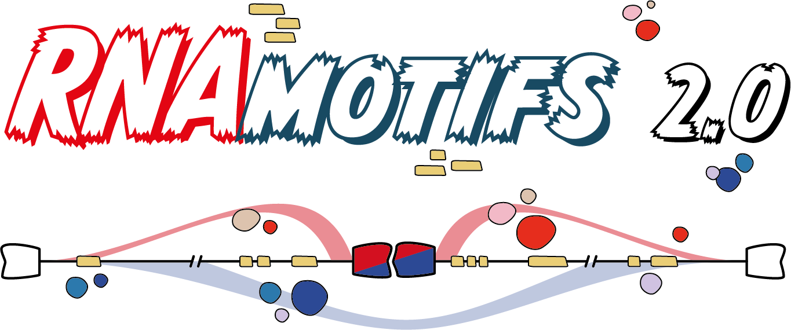
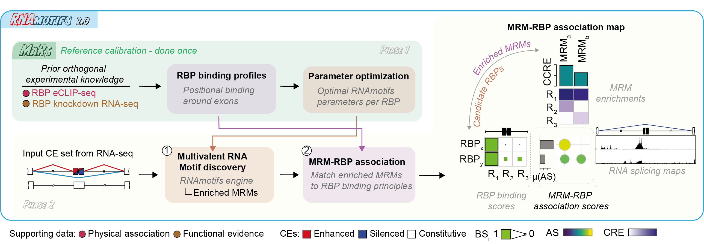
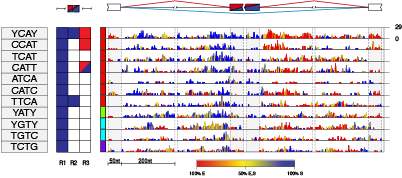
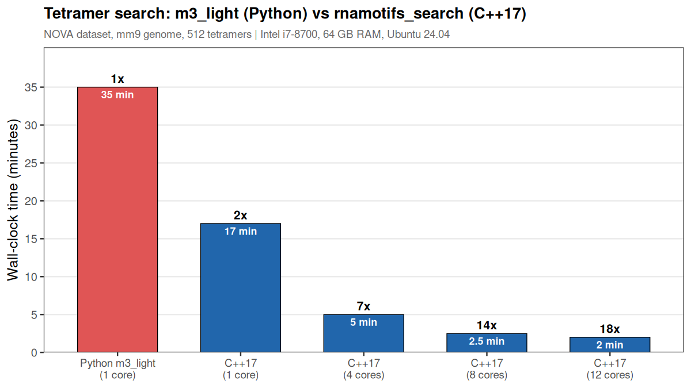

<p align="center">
  
</p>

<h3 align="center">Prediction of multivalent RNA motifs controlling alternative splicing</h3>

<p align="center">
  <a href="#installation">Installation</a> &middot;
  <a href="#quick-start">Quick start</a> &middot;
  <a href="#usage">Usage</a> &middot;
  <a href="#tools">Tools</a> &middot;
  <a href="#rnamotifs-mars">MaRs</a> &middot;
  <a href="#documentation">Documentation</a> &middot;
  <a href="#performance">Performance</a> &middot;
  <a href="#citation">Citation</a>
</p>

---

RNAmotifs identifies clusters of short RNA motifs (tetramers) enriched at specific positions around alternatively spliced exons regulated by RNA-binding proteins. It generates **RNA splicing maps** showing positional enrichment of multivalent motifs around enhanced and silenced exons, with optional **RNA secondary structure** and **evolutionary conservation** profiling.

<p align="center">
  
</p>

<p align="center"><em>RNAmotifs discovers positionally enriched multivalent RNA motifs (MRMs); the <strong>MaRs</strong> module calibrates a reference panel from eCLIP + knockdown data (Phase 1) and matches enriched MRMs to RBP binding to identify the regulating protein (MRM–RBP association).</em></p>

RNAmotifs has been used to identify motifs bound by NOVA, PTBP1, hnRNP C, TARDBP, TIA1 and TIAL1.

<p align="center">
  
</p>

## Citation

> Cereda M, Pozzoli U, Rot G, Juvan P, Schweitzer A, Clark T, Ule J.
> *RNAmotifs: prediction of multivalent RNA motifs that control alternative splicing.*
> Genome Biol. 2014;15(1):R20.
> [PMID: 24485098](https://pubmed.ncbi.nlm.nih.gov/24485098/)

---

## Installation

### Linux (Ubuntu/Debian)

```bash
# 1. Install system dependencies
sudo apt-get update
sudo apt-get install -y build-essential g++ cmake \
    gfortran liblapack-dev libblas-dev libpng-dev libjpeg-dev \
    python3 r-base

# 2. Build C++ binaries
mkdir build && cd build
cmake ..
make -j$(nproc)
cd ..

# 3. Install R packages
Rscript -e 'install.packages(c("lattice", "latticeExtra",
  "ggplot2", "reshape2", "bootstrap"), repos="https://cloud.r-project.org")'

# 4. (Optional) Install ViennaRNA for --structure
sudo apt-get install -y vienna-rna libvienna-rna-dev
```

### macOS (Homebrew)

```bash
# 1. Install dependencies (GCC recommended for OpenMP)
brew install gcc cmake r vienna-rna

# 2. Build with GCC (adjust version number, e.g. gcc-13)
mkdir build && cd build
cmake .. -DCMAKE_C_COMPILER=gcc-13 -DCMAKE_CXX_COMPILER=g++-13
make -j$(sysctl -n hw.ncpu)
cd ..

# 3. Install R packages
Rscript -e 'install.packages(c("lattice", "latticeExtra",
  "ggplot2", "reshape2", "bootstrap"), repos="https://cloud.r-project.org")'
```

### Genome setup

```bash
cd genomes
./mm9.download.sh    # Mouse NCBI37
./hg19.download.sh   # Human GRCh37
./hg38.download.sh   # Human GRCh38
./mm10.download.sh   # Mouse GRCm38
./mm39.download.sh   # Mouse GRCm39
cd ..
```

### PhyloP conservation data (optional)

```bash
cd genomes
./download_phylop.sh mm9    # 30-way vertebrate PhyloP
./download_phylop.sh hg19   # 100-way vertebrate PhyloP
cd ..
```

### Requirements summary

| Component | Required | Notes |
|-----------|----------|-------|
| C++17 compiler + OpenMP | Yes | GCC >= 7 (Linux), GCC via Homebrew (macOS) |
| CMake >= 3.10 | Yes | |
| Python >= 3.8 | Yes | |
| R >= 4.0 | Yes | `lattice`, `latticeExtra`, `ggplot2`, `reshape2`, `bootstrap` |
| ViennaRNA | Optional | For `--structure` profiling |
| PhyloP `.bin` files | Optional | For `--conservation` profiling |

All C++ binaries are self-contained -- no external C++ library dependencies.

---

## Quick start

```bash
./rnamotifs examples/NOVA.txt \
    --name NOVA --genome mm9 \
    --bootstraps 10000 --cores 10 \
    --p-empirical 0.001 \
    --structure --conservation
```

---

## Usage

```bash
./rnamotifs <exon_file> -n NOVA -g mm9 --n 30 -e 30 -b 1000 -c 10 --p-empirical 0.01
```

Parameters use **paper notation** — `n` is the clustering window (`n = 2·hw`; `--n 30` ⇔ `-w 15`) and `e` is the enrichment window. The most-tuned options:

| Option | Meaning | Default |
|--------|---------|---------|
| `--n` | clustering window `n` (= 2·hw) | 30 |
| `-e, --enrichment-window` | enrichment window `e` (bp) | 30 |
| `-b, --bootstraps` | empirical-FDR bootstrap iterations (per-iteration seed → **core-independent**); 1000 is the practical setting | 10000 |
| `--p-empirical` | empirical p-value cutoff (`0.01` with `-b 1000`) | 0.00005 |
| `-k, --kmer-size` | motif (MRM) length; `4` is validated | 4 |
| `--event-type` | `SE` (skipped exon) or 🚧 `RI` (intron retention) | SE |
| `--from-rmats` | import an rMATS SE/RI table directly | off |
| 🚧 `--structure` / `--conservation` | ViennaRNA / PhyloP profiling | off |

An MRM is called enriched when, per region (R1/R2/R3) and direction (enhanced/silenced), `pFis ≤ min(1st-percentile, 0.05)` **and** `pEmp ≤ --p-empirical`.

> **Full reference** — every flag, the exact input format, output files, worked examples and troubleshooting live in the **[tutorial](docs/tutorial/)**:
> [Parameters](docs/tutorial/parameters.md) · [Input format](docs/tutorial/input-format.md) · [Output](docs/tutorial/output.md) · [Examples](docs/tutorial/examples.md) · [Troubleshooting](docs/tutorial/troubleshooting.md) · [RNAmotifs-MaRs](docs/tutorial/rnamotifs-mars.md).

### Supported genomes

| Genome | Species | Assembly |
|--------|---------|----------|
| `hg19` | Human | GRCh37 |
| `hg38` | Human | GRCh38 |
| `mm9`  | Mouse | NCBI37 |
| `mm10` | Mouse | GRCm38 |
| `mm39` | Mouse | GRCm39 |

---

## Tools

### `rnamotifs` -- Main pipeline

The core tool. Runs the complete motif discovery pipeline from splicing file to RNA splicing maps.

### `rnamotifs-extract` -- Export enriched tetramer coordinates

```bash
./rnamotifs-extract results/<name>/<run_name>                    # All enriched, TSV
./rnamotifs-extract results/<name>/<run_name> -t YCAY --bed      # Specific tetramer, BED
./rnamotifs-extract results/<name>/<run_name> -c silenced -o out.tsv
```

| Option | Description | Default |
|--------|-------------|---------|
| `results_dir` | Path to a completed results folder (positional) | required |
| `-t, --tetramer` | Extract for a specific tetramer | all enriched |
| `-c, --category` | Exon category: `enhanced`, `silenced`, `both` | both |
| `-o, --output` | Output file | stdout |
| `--bed` | Output in BED format | TSV |

### `rnamotifs-mars` -- MRM-RBP association scores

See the dedicated [RNAmotifs-MaRs](#rnamotifs-mars) section below.

---

## RNAmotifs-MaRs

RNAmotifs-MaRs integrates RNAmotifs motif discovery with eCLIP RBP binding data to compute **MRM-RBP association scores**. It extends the [RNAMaRs](https://github.com/ceredamatteo-lab/theRNAmars) framework by coupling it directly with the RNAmotifs motif enrichment pipeline.

### How it works

The pipeline runs in three phases:

| Phase | Name | What it does |
|-------|------|-------------|
| **1** | Multi-parameter sweep | Runs RNAmotifs across multiple `(n, e)` parameter combinations to identify enriched MRMs under different clustering stringencies |
| **2** | Signal recovery rate (SRR) | For each RBP, downsamples eCLIP peaks and measures how robustly motif positions recover the eCLIP signal |
| **3** | Cosine similarity (CS) | Computes the cosine similarity between the RNAmotifs positional profile and the eCLIP binding profile, producing a profile-level association score |

The association score combines the two as **AS = CS × SRR** by default. The SRR
weight down-weights RBPs whose eCLIP map is poorly reproducible; on uniformly high-quality eCLIP it is
empirically neutral, so it can be disabled with `--score-mode cs-only` (AS = CS), leaving the cosine
similarity as the sole driver. The combined scores are visualised as heatmaps showing MRM-RBP associations.

#### Notation: paper ↔ code

The publication and the code use different names for the same quantities. The code retains its internal
names (and on-disk keys such as `hw_X_ew_Y`, `SCORE1_*`, `SCORE2_*`) for stability; the mapping is:

| Paper | Code (CLI / output) | Note |
|-------|---------------------|------|
| **n** (clustering window) | `hw` / `-w, --half-window` | **n = 2·hw** (e.g. n=30 ↔ hw=15). Pass `--n` to use paper units directly. |
| **e** (enrichment window) | `ew` / `-e, --enrichment-window` | identical value (e = ew). |
| **SRR** (signal recovery rate) | `SCORE1` | eCLIP-map robustness weight. |
| **CS** (cosine similarity) | `SCORE2` | motif-vs-eCLIP profile match. |
| **AS** (association score) | combined score | AS = CS × SRR (`--score-mode full`); AS = CS (`cs-only`). |
| **MRM** (multivalent RNA motif) | tetramer / motif cluster | enriched 4-nt degenerate motif. |

### Modes & key options

`rnamotifs-mars` runs in two modes:

- **`--mode discovery`** — *train* the reference panel. For each RBP it sweeps `(n, e)`
  (`--param-grid-n` / `--param-grid-e`, or `--optim bayes`) and picks the combination that
  maximises the AS-based identification AUROC (true-vs-other rank). **If the best AUROC < 0.5**
  (worse than random) the RBP falls back to the default `n=30, e=30`. Writes
  `Tables/RNAmotifs_optimal_parameters.csv`, the SRR/PEAK references, and a resumable
  `discovery_manifest.json`.
- **`--mode application`** — *score* a new splicing dataset against a trained panel
  (Phase 1 sweep → Phase 2 `rnamotifs_mars_score` → Phase 3 `generate_heatmap.R`), ranking the
  reference RBPs to identify the regulator.

Common flags:

| Flag | Meaning |
|------|---------|
| `--score-mode full\|cs-only` | AS = CS × SRR (default) or AS = CS (SRR weight disabled) |
| `--param-grid-n` / `--param-grid-e` | discovery grid in paper notation (default `10 30 50 70` / `30 50 100 200 300`) |
| `--optim grid\|bayes` | exhaustive grid (default) or Bayesian optimisation |
| `--make-heatmaps` | after discovery, render the Figure-4A final heatmaps (AS dot-heatmap + per-RBP RNA splicing maps) for every RBP, reusing cached sweeps; `--heatmap-top-mrms/-rbps N` crop to the top signal |

Discovery is **resumable** (skips completed RBPs/combos via the manifest) and memory-light
(RBPs processed sequentially, < 2 GB peak). A full grid run (~28 RBPs × 20 combos, `-b 1000`)
takes ~9–12 h on 10 cores; re-running with cached sweeps re-scores in minutes.

> See the **[RNAmotifs-MaRs tutorial](docs/tutorial/rnamotifs-mars.md)** for the full flag
> list, required data layout, output files, and worked discovery/application examples.

### R dependencies for MaRs

Install with `Rscript install_mars_deps.R`. Key packages:

- **ComplexHeatmap** (Bioconductor) -- heatmap visualisation
- **lsa** -- cosine similarity computation
- **circlize**, **viridis** -- colour palettes
- **data.table**, **dplyr**, **tidyr** -- data manipulation

---

## Documentation

This README is a high-level overview. Full usage documentation lives in the **[tutorial / wiki](docs/tutorial/)**:

- **[Getting started](docs/tutorial/README.md)** — what RNAmotifs does and how the algorithm works
- **[Input format](docs/tutorial/input-format.md)** — file layout, the `dIRank` convention, rMATS import
- **[Parameters](docs/tutorial/parameters.md)** — every flag, with tuning guidance
- **[Output & interpretation](docs/tutorial/output.md)** — reading the RNA splicing map
- **[Examples](docs/tutorial/examples.md)** — copy-paste recipes (NOVA, PTBP1, rMATS, intron retention)
- **[RNAmotifs-MaRs](docs/tutorial/rnamotifs-mars.md)** — discovery & application modes
- **[Troubleshooting](docs/tutorial/troubleshooting.md)** — FAQ and common pitfalls

Data preprocessing (ENCODE eCLIP + rMATS → exon sets and binding profiles) is documented in [`docs/data_preprocessing_methods.md`](docs/data_preprocessing_methods.md).

---

## Performance

*All benchmarks: NOVA dataset (4,368 exons), mm9 genome. Intel i7-8700 @ 3.20 GHz (6c/12t), 64 GB RAM, Ubuntu 24.04 LTS.*

### Tetramer search: Python m3_light vs C++17

<p align="center">
  
</p>

| Implementation | Cores | Time | Speedup |
|---------------|-------|------|---------|
| Python m3_light (v1) | 1 | ~35 min | 1x |
| C++17 rnamotifs_search (v2) | 1 | ~17 min | **2x** |
| C++17 rnamotifs_search (v2) | 4 | ~5 min | **7x** |
| C++17 rnamotifs_search (v2) | 12 | ~2 min | **18x** |

The C++ implementation produces **byte-identical output** to the Python
m3_light module (verified: 0 diffs across 1024 BED files, both alphabets).

### Bootstrap FDR

| Implementation | Cores | 10,000 iterations | Speedup |
|---------------|-------|-------------------|---------|
| R bootstrap-FDR.R (v1) | 1 | ~90 sec | 1x |
| C++17 rnamotifs_bootstrap (v2) | 1 | ~20 sec | **4.5x** |
| C++17 rnamotifs_bootstrap (v2) | 12 | ~2 sec | **~45x** |

### Full pipeline

| Pipeline | Cores | Time |
|----------|-------|------|
| v1 (Python 2 + R + C++03) | 1 | ~40 min |
| v2 (C++17 + OpenMP + R) | 12 | ~5 min |
| v2 with `--structure --conservation` | 12 | ~1h 11min |

Structure and conservation profiling are I/O-bound (ViennaRNA folding, PhyloP lookup) and dominate the runtime when enabled.

### Result reproducibility

The v2 C++ motif search produces **byte-identical BED output** to the v1
Python `m3_light` module. The C++ bootstrap FDR uses the same Fisher exact
test, BH adjustment, and resampling strategy as the R implementation.
Both were verified on the NOVA dataset with matching parameters.

### Key optimisations

- **Indexed BED lookup** -- O(log N) binary search per exon vs O(N) linear scan
- **Dense arrays + prefix sums** -- O(1) window queries vs O(hw) hash-map iteration
- **Chromosome preloading** -- full in-memory genome vs per-region file I/O
- **OpenMP parallelism** -- 512 motifs processed across all CPU cores
- **Constrained partition function** -- ViennaRNA with `compute_bpp=0` for structure profiling

See [bench/](bench/) for full details and reproduction scripts.

---

## What's new in v2.0

v2.0 is a complete rewrite of the [original RNAmotifs](https://github.com/ceredamatteo-lab/RNAmotifs). Same algorithm, same results, modernised implementation.

| Component | v1 | v2 |
|-----------|----|----|
| Orchestrator | Bash (`RNAmotifs.sh`) | Python 3 CLI (`argparse`) |
| Motif search | Python 2 (`m3_light`) | C++17 / OpenMP |
| Positional mapping | C++ with vendored GeCo++ | C++17 (no dependencies) |
| Bootstrap FDR | R | C++17 / OpenMP |
| Build system | CMake 2.6 | CMake 3.10+ |

### New features

- **Intron retention support** (`--event-type RI`) -- full motif analysis for retained introns, with R2/R3 scanning the intron body and R1/R4 the flanking exons. Works with `--from-rmats` for direct RI.MATS import. Lattice-based RNA splicing maps adapted with exonic shading on flanking regions and splice site tick marks
- **RNAmaRs discovery mode** (`--mode discovery`) -- automated parameter optimization for training RBP reference panels, with crash-safe JSON manifest resumption
- **C++ association scoring** (`rnamotifs_mars_score`) -- replaces R-based scoring with memory-safe sequential RBP processing (<2 GB peak RAM)
- **Multicore support** -- OpenMP for tetramer search and bootstrap FDR
- **RNA structure profiling** (`--structure`) -- ViennaRNA constrained-PF heatmaps
- **Conservation profiling** (`--conservation`) -- PhyloP heatmaps
- **Cluster-averaged profiles** -- smoothed curves with ribbon fill
- **Parametric region sizes** (`--in-exon`, `--in-intron`) -- adaptive clamping for short exons/introns
- **rMATS input** (`--from-rmats`) -- direct import of Skipped Exon and Retained Intron output
- **Additional genomes** -- hg38, mm10
- **Exon extraction** (`rnamotifs-extract`) -- BED/TSV export
- **MRM-RBP associations** (`rnamotifs-mars`) -- eCLIP integration

### Code quality

- Python 2 -> Python 3.8+; C++03 -> C++17
- Removed all GeCo++ dependency -- pure standard C++17
- Zero external C++ libraries (ViennaRNA optional)
- Structured output with parameter encoding and pipeline logging

---

## Project structure

```
RNAmotifs2/
├── rnamotifs                  # Main pipeline (Python 3)
├── rnamotifs-extract          # Exon coordinate extraction
├── rnamotifs-mars             # MRM-RBP associations
├── CMakeLists.txt             # Build system
├── install_mars_deps.R        # MaRs R dependency installer
├── src/
│   ├── cpp/                   # C++17 / OpenMP
│   │   ├── rnamotifs_core.h/cpp
│   │   ├── rnamotifs_search.cpp
│   │   ├── rnamotifs_mars_score.cpp
│   │   ├── rnamotifs_selection.cpp
│   │   ├── tetramer.cpp
│   │   ├── counting.cpp
│   │   ├── bootstrap_fdr.cpp
│   │   ├── rnamotifs_structure.cpp
│   │   └── rnamotifs_conservation.cpp
│   └── R/
│       ├── config.R
│       ├── selection.R
│       ├── structure_profile.R
│       ├── conservation_profile.R
│       ├── cluster_profile.R
│       └── mars/              # RNAMaRs R scripts
│           ├── compute_association_scores.R
│           ├── generate_heatmap.R
│           ├── figure_parameter_optimization.R
│           ├── selection_of_tetramers.R
│           ├── sign_reg_plot.R
│           ├── config_RNAmars.R
│           └── conf/
├── genomes/                   # Genome downloads & PhyloP (hg19, hg38, mm9, mm10, mm39)
├── examples/                  # NOVA example + output figures
├── benchmarks/                # Performance comparison
└── LICENSE
```

## Contributors

Designed by **Matteo Cereda** and **Jernej Ule**.
Main developer: Matteo Cereda.
Contributing developers: Gregor Rot, Peter Juvan, Uberto Pozzoli.

## License

[GPL-2.0-or-later](LICENSE)
